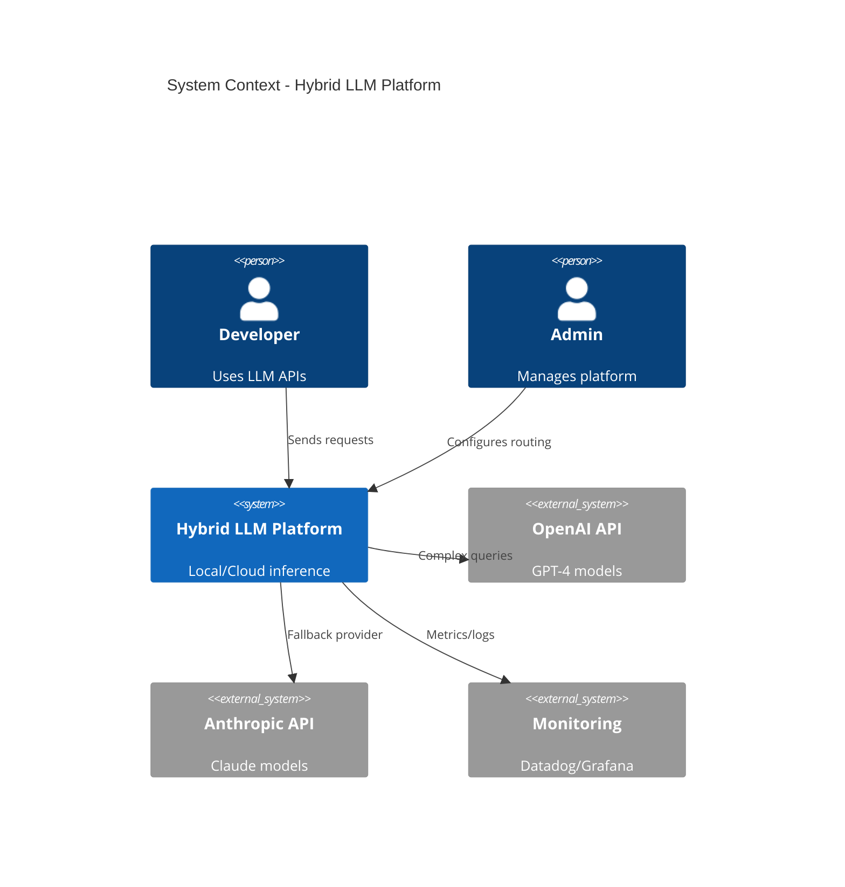
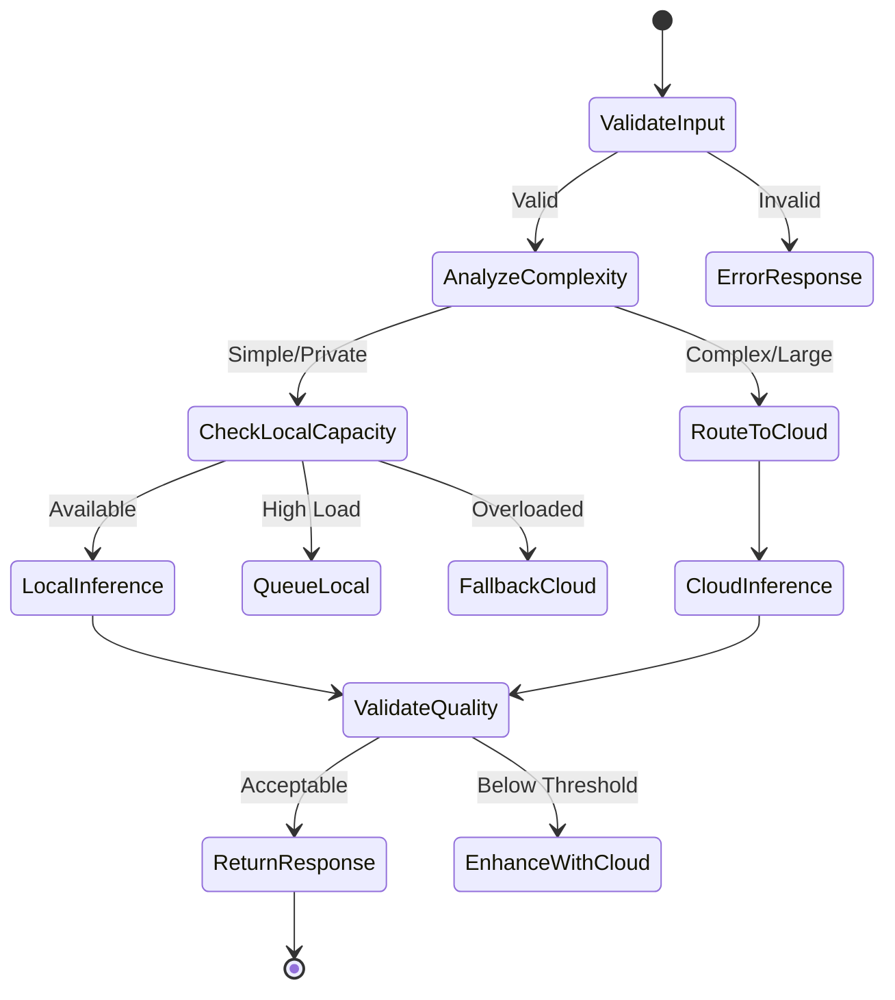

# Building a Hybrid LLM Platform Backend: Technical Specification Guide and Architecture Best Practices

## RTX 4090 delivers 82% performance at 50% power for optimal local inference efficiency

Building a hybrid LLM platform that seamlessly switches between local GPU inference and cloud APIs requires careful architectural planning, robust documentation, and proven implementation patterns. This comprehensive guide synthesizes industry best practices, real-world implementations, and technical specifications for creating a production-ready hybrid LLM backend that supports both local vLLM on RTX 4090 GPUs and cloud providers like OpenAI, Anthropic, and Cohere.

## Technical specification document structure optimized for AI/ML platforms

The most effective technical specifications for AI/ML platforms follow Eugene Yan's widely-adopted ML Design Document template, enhanced with hybrid architecture considerations. The essential structure includes an **Executive Summary** (3-5 sentences covering purpose, problem, solution, and desired outcome), followed by **Background & Motivation** that articulates business goals and success criteria. The **Requirements** section must distinguish between functional capabilities, non-functional performance targets, and explicit constraints, while clearly marking out-of-scope items.

For hybrid LLM platforms specifically, the **Methodology** section should detail the decision framework for local versus cloud routing, data flow patterns, and validation approaches. The **Implementation** section becomes critical, requiring detailed system architecture diagrams, infrastructure specifications for both local GPU clusters and cloud integrations, comprehensive security controls, and multi-environment monitoring strategies. Organizations should include an **Alternatives Considered** section documenting trade-offs between different architectural approaches, particularly the rationale for hybrid versus pure-cloud or pure-local deployments.

Major tech companies provide valuable templates: Google's Vertex AI documentation emphasizes MLOps integration and collaborative review processes, Microsoft Azure focuses on enterprise compliance and integration patterns, while AWS's Well-Architected Framework provides comprehensive guidance on security, reliability, and performance efficiency. For regulatory compliance, align documentation with ISO/IEC/IEEE 29148:2018 for requirements engineering and IEEE software engineering standards for technical documentation quality.

## Architectural patterns enable token-level collaboration between local and cloud models

Research reveals three primary architectural patterns for hybrid LLM systems. The **token-level hybrid collaboration** pattern achieves remarkable efficiency by having small language models (SLMs) on edge devices dynamically interact with cloud LLMs during inference. In this pattern, the local SLM generates vocabulary distributions and uploads them to the cloud LLM for acceptance or rejection, with rejected tokens being resampled by the cloud model. This approach delivers LLM-comparable quality while reducing cloud costs by 61.2% on complex tasks.

The **speculative inference architecture** leverages local GPUs to generate draft tokens that cloud LLMs validate or correct in parallel. This pattern works particularly well with RTX 4090 GPUs running vLLM, where the local model handles the computationally lighter draft generation while cloud resources focus on quality validation. The **multi-model collaboration framework** recognizes that different inference phases have distinct computational requirements - the compute-bound prefill phase versus the memory-bound decode phase - and routes accordingly.

For production deployments, implement a three-tier hybrid design: an **Edge Tier** with local RTX 4090 GPUs running vLLM for low-latency private inference, a **Gateway Tier** providing intelligent routing and failover management, and a **Cloud Tier** offering scalable APIs for complex tasks and peak loads. This architecture supports workload-aware routing using reinforcement learning-based routers that achieve 11% lower end-to-end latency compared to static routing strategies.

## Intelligent routing reduces cloud LLM usage by 61.2% while maintaining accuracy

The most effective routing strategies combine multiple decision factors. **Content-based routing** evaluates task complexity, input length, and domain specificity to determine the optimal processing location. Simple factual queries and privacy-sensitive requests route to local models, while complex reasoning tasks requiring larger context windows route to cloud providers. **Performance-based routing** monitors real-time metrics including latency, throughput, and queue depths to make dynamic routing decisions.

Implement **reward-based token modeling** where each token is evaluated independently using configurable reward thresholds. Tokens with high confidence scores from the local model proceed without cloud validation, while uncertain tokens trigger cloud LLM assistance. This granular approach significantly reduces cloud API calls while maintaining output quality above baseline SLM performance.

Advanced implementations use the **Consistent Hashing with Bounded Loads (CHWBL)** algorithm for load balancing, achieving 95% reduction in Time-To-First-Token and 127% throughput increase. The algorithm maximizes cache utilization by routing similar requests to the same replicas while preventing hotspots through load bounds. For multi-LoRA deployments, this approach maintains distinct prefix caches for each adapter, optimizing memory usage across the cluster.

## LiteLLM provides production-ready abstraction for 100+ LLM providers

For API abstraction layers, LiteLLM emerges as the most comprehensive solution, supporting over 100 LLM providers through a unified OpenAI-compatible interface. The framework handles provider-specific translations, automatic retry logic, fallback routing, and comprehensive cost tracking. Its architecture includes a Python SDK for direct integration, a proxy server functioning as an LLM gateway with authentication, and an admin UI for configuration management.

The configuration follows a declarative YAML approach that supports environment variable references for secure credential management:

```yaml
model_list:
  - model_name: gpt-4-production
    litellm_params:
      model: azure/gpt-4-deployment
      api_key: "os.environ/AZURE_API_KEY"
      rpm: 6000
      tpm: 600000
  - model_name: claude-fallback
    litellm_params:
      model: anthropic/claude-3-sonnet
      api_key: "os.environ/ANTHROPIC_API_KEY"
  - model_name: local-llama
    litellm_params:
      model: vllm/meta-llama/Llama-2-7b-chat
      api_base: "http://localhost:8000"
```

This configuration enables seamless switching between providers while maintaining consistent interfaces. The framework automatically handles provider-specific parameter mapping, response format standardization, and error code translation, allowing applications to treat all LLM providers uniformly.

## Multi-layer configuration enables hot-reloading and A/B testing capabilities

Effective configuration management requires a hierarchical approach with **global settings** defining default timeouts and retry policies, **provider settings** specifying API endpoints and authentication methods, **model settings** controlling parameters like temperature and token limits, and **environment overrides** supporting development versus production configurations.

Implement dynamic configuration patterns including hot-reload capabilities for configuration updates without service restarts, Kubernetes ConfigMap integration for cloud-native deployments, and database-driven configurations for runtime model registration. This flexibility supports A/B testing scenarios where different configuration variants can be evaluated simultaneously.

Security considerations mandate storing API keys in dedicated secrets management services like HashiCorp Vault or AWS Secrets Manager, implementing regular key rotation schedules, and monitoring for unusual usage patterns. Never hardcode credentials in source code or configuration files - always use environment variable references or secrets management APIs.

## C4 model diagrams visualize architecture from context to component level

Mermaid diagrams provide version-controllable architecture documentation that evolves with your codebase. Start with C4 model diagrams to communicate architecture at multiple abstraction levels. The **System Context** diagram shows how your hybrid LLM platform interacts with external systems:



The **Container** diagram details internal components and their interactions, showing the API gateway, routing engine, local inference cluster, and monitoring infrastructure. Use **sequence diagrams** to document request flows, particularly the decision logic for routing between local and cloud resources.

For LLM-specific state machines, document the routing decision flow:



## Real implementations show 20x cost reduction with proper optimization

Production deployments demonstrate significant cost savings through hybrid architectures. ScaleLLM achieved hosting three LLaMA-2-13B services on a single A100 GPU with 1.88x lower latency than baseline vLLM deployments. For RTX 4090 configurations, optimal performance occurs at 50-60% power limits (220W), delivering 82% of maximum performance while significantly reducing electricity costs and heat generation.

A dual RTX 4090 setup with tensor parallelism proves cost-effective for 14B-16B parameter models, providing stable performance at 20x lower cost than cloud A100 instances. Key optimizations include limiting concurrent requests to 50 for larger models, implementing continuous batching for 23x throughput improvement, and using PagedAttention for efficient memory allocation.

Real-world implementations like AWS GenAIIC's hybrid RAG systems combine local vector search with cloud-based language models, achieving improved retrieval accuracy while maintaining data locality for sensitive information. These systems demonstrate that 70-80% of queries can be handled by local infrastructure, with cloud resources reserved for complex reasoning tasks and peak load scenarios.

## Comprehensive monitoring tracks quality, cost, and performance across providers

Effective observability requires tracking operational metrics (request volumes, latency percentiles, error rates by provider), quality metrics (response accuracy, hallucination detection, output consistency), and business metrics (cost per request, provider comparisons, ROI measurements). Implement distributed tracing to follow requests across the hybrid infrastructure, capturing provider selection rationale, token usage, and response quality scores.

Use OpenTelemetry for standardized telemetry collection, enhanced with LLM-specific instrumentation for token-level metrics. Visualization through Grafana dashboards should highlight key performance indicators including Time-To-First-Token (TTFT) by provider, cost accumulation trends, and quality degradation patterns. Establish critical alerts for high error rates, unusual cost spikes, security anomalies, and SLA violations, routing notifications through appropriate channels based on severity.

## Conclusion

Building a hybrid LLM platform requires careful balance of local and cloud resources, robust abstraction layers, and comprehensive monitoring. The architecture should leverage RTX 4090 GPUs at optimized power settings for cost-effective local inference of models up to 8B parameters, while maintaining seamless failover to cloud providers for larger models and peak loads. 

Start with proven frameworks like LiteLLM for multi-provider abstraction, implement intelligent routing based on task complexity and resource availability, and maintain detailed technical documentation using version-controlled Mermaid diagrams. Success depends on continuous optimization based on real usage patterns, proactive monitoring of both technical and business metrics, and regular updates to routing strategies as model capabilities and costs evolve.

The rapid advancement in both local GPU capabilities and cloud API offerings suggests that hybrid architectures will become increasingly sophisticated. Organizations that invest in flexible, well-documented hybrid platforms today will be best positioned to leverage future innovations in the LLM ecosystem while maintaining cost efficiency and performance excellence.
